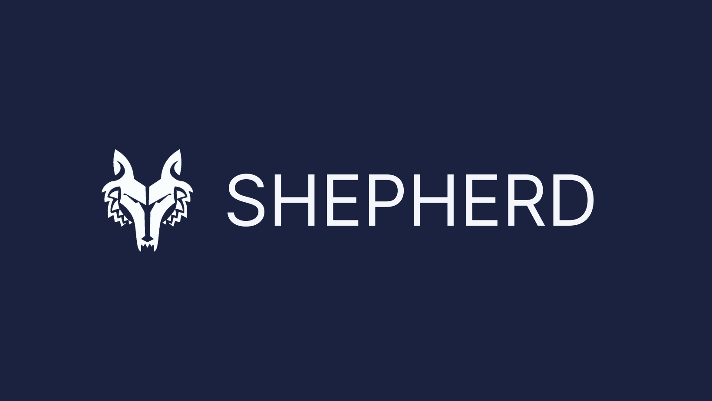

<!--
*** This ReadMe document was insipred by the ReadMe template from
*** https://github.com/othneildrew/Best-README-Template
-->

<!--
*** https://www.markdownguide.org/basic-syntax/#reference-style-links
-->

<!-- PROJECT LOGO -->
<div  align="center">

<h1>AWS Serverless Function Monitoring Tool</h1>

<!-- PROJECT SHIELDS -->

[![Contributors][contributors-shield]][contributors-url]
[![Stargazers][stars-shield]][stars-url]
[![Issues][issues-shield]][issues-url]
[![MIT License][license-shield]][license-url]

</div>

<!-- TABLE OF CONTENTS -->
<details open="open">
  <summary>Table of Contents</summary>
  <ol>
      <li><a href="#motivation-for-project">Motivation for Project</a></li> 
      <li><a href="#getting-started">Getting Started</a></li>      
      <li><a href="#aws-end-users">AWS End Users</a></li>
      <ul>
        <li><a href="#installation-and-setup">Installation and Setup</a></li>      
        <li><a href="#lambda-metrics">Lambda Metrics</a></li>     
        <li><a href="#user-profile">User Profile</a></li>     
      </ul>
      <li><a href="#developers">Developers</a></li>
      <ul>
            <li><a href="#built-with">Built With</a></li>     
            <li><a href="#project-setup">Project Setup</a></li> 
                  </ul>
    <li><a href="#contributors">Contributors</a></li>
    <li><a href="#license">License</a></li>
  </ol>
</details>

<!-- ABOUT THE PROJECT -->

## Motivation for Project

Serverless Applications are becoming increasingly popular as they relieve organizations and programmers from worrying about provisioning and maintaining the servers to just focusing on developing and deploying the code. It is also cost-effiecient in many scenarios as servers are running only when an event (for e.g. an API request) is triggered.

AWS is a leading provider in the serverless applications space with AWS Lambda functions being its central component of the architecture. However, with AWS’ numerous services and extensive docs, it becomes challenging to navigate and can be intimidating to monitor and track the health of serverless applications.

Shepherd is a free, open-source monitoring tool that users can connect to their AWS account and easily track key metrics and logs. Here is a [medium](https://www.google.com) article describing the philosophy behind Shepherd. The application can be downloaded [here](https://google.com). 

<!-- GETTING STARTED -->

## Getting Started

The following instructions are split into two sections for:

- [AWS End Users](#aws-end-users)
- [Developers](#developers)

## AWS End Users

This section describes the instructions for AWS end users who would like to [download](https://google.com) the application and connect their AWS account. For developers who would like to contribute to the open-source project, follow these [instructions](#developers).

### Installation and Setup

1. Download the Shepherd application [here](https://google.com)
2. Existing users enter email and password to login
3. For new users click Signup to create a new user account
4. Assign a Cloud Formation Stack 
5. Copy and paste the unique AWS ARN outputted from the prior step
6. Login with the registered credentials
7. Done!

<p  align="center">

</br>

</p>

The Shepherd application is preconfigured to track the main components of AWS serverless applications. Once the user is logged in these components can be visualized through the side navigation menu.

### Lambda Metrics

Displays the aggregated metrics for their Lambda functions including: Throttles, Invocations, and Errors. The metric totals by Lambda function are also shown in tabular format. Users have an option to further visualize metrics for specific functions. Users can adjust the time period shown.

<p  align="center">

</p>


<p  align="center">

</p>


### User Profile

Users can update the profile and their ARN key, as well as their registered emails and passwords.

## Developers

This section describes the instructions for developers who would like to download and contribute to the open-source Shepherd project. For AWS end users who would like to download the application and connect their AWS account, follow these [instructions](#aws-end-users) instead.

### Built With

The Shepherd application was built using the following key frameworks / libraries for the front-end and back-end:

- [React](https://reactjs.org/)
- [ReactRouter](https://reactrouter.com/)
- [TypeScript](https://www.typescriptlang.org/)
- [NodeJS](https://nodejs.org/en/)
- [Express](https://expressjs.com/)
- [MongoDB](https://www.mongodb.com/)
- [Mongoose](https://mongoosejs.com/)
- [Electron](https://www.electronjs.org/)

### Project Setup

The pre-requisite software for setting up this application are:

- [NodeJS](https://nodejs.org/en/)
- [NPM ](https://www.npmjs.com/)

1. Clone the repo
   ```sh
   git clone https://github.com/oslabs-beta/shepherd.git
   cd shepherd
   ```
2. Install the package dependencies
   ```sh
   npm install
   ```
3. Update the `.env` file in the project root directory with the necessary credentials
   ```sh
   AWS_ACCESS_KEY_ID
   AWS_SECRET_ACCESS_KEY
   MONGODB_URI
   ```
4. The application can be run in development mode by running the following command and going to http://localhost:8080/ on your browser

   ```sh
   npm run dev
   ```

5. Additionally, you can build and run the application (in Electron) with the following commands. This should start up the electron application
   ```sh
   npm run build

   npm run app
   ```

<!-- CONTACT -->

## Contributors

- Andrew Nguyen  - [Github](https://github.com/AndrewNguyenn) | [Linkedin](https://www.linkedin.com/in/andrewconannguyen/)
- Michael Hoang -[Github](https://github.com/michaelhoang781) | [Linkedin](https://www.linkedin.com/in/michael-hoang-91b68632/)
- Connor Gillis - [Github](https://github.com/connor-gillis) | [Linkedin](https://www.linkedin.com/in/connor-gillis/)
- Baron Bugarcic - [Github](https://github.com/bugarcic) | [Linkedin](https://www.linkedin.com/in/baronbugarcic/)

Project Links: [Website](https://projecthelios.io) | [Github](https://github.com/oslabs-beta/shepherd) | [Linkedin](https://www.linkedin.com/company/shepherd-io)

<!-- LICENSE -->

## License

Distributed under the MIT License.

<!-- MARKDOWN LINKS & IMAGES -->
<!-- https://www.markdownguide.org/basic-syntax/#reference-style-links -->

[contributors-shield]: https://img.shields.io/github/contributors/oslabs-beta/shepherd.svg?style=for-the-badge
[contributors-url]: https://github.com/oslabs-beta/shepherd/graphs/contributors
[stars-shield]: https://img.shields.io/github/stars/oslabs-beta/shepherd.svg?style=for-the-badge
[stars-url]: https://github.com/oslabs-beta/shepherd/stargazers
[issues-shield]: https://img.shields.io/github/issues/oslabs-beta/shepherd.svg?style=for-the-badge
[issues-url]: https://github.com/oslabs-beta/shepherd/issues
[license-shield]: https://img.shields.io/github/license/oslabs-beta/shepherd.svg?style=for-the-badge
[license-url]: https://github.com/oslabs-beta/shepherd/blob/master/LICENSE.txt
[linkedin-shield]: https://img.shields.io/badge/-LinkedIn-black.svg?style=for-the-badge&logo=linkedin&colorB=555
[linkedin-url]: https://www.linkedin.com/company/shepherd-io
[product-screenshot]: client/src/Dashboard/assets/img/helios-blue-logo-t.png